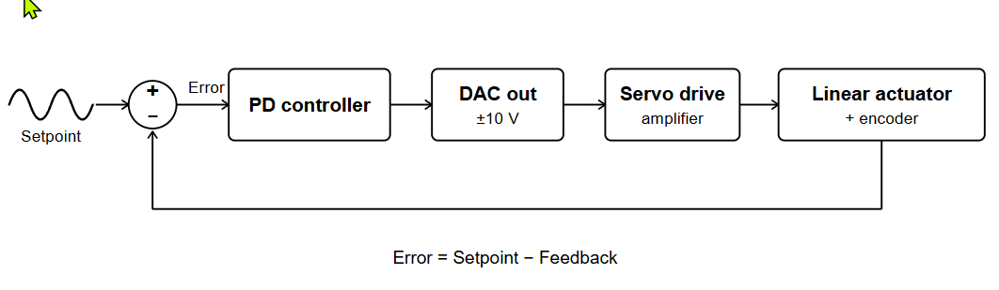

# pid_controller

### demo link
https://youtu.be/ty8xQv0ohg8?si=NDRTQDqTo5Z_6vpp

### Simulation link
- [Linear actuator simulation](doc/linear_actuator_sim.html)

Here's a clean README description:

---

# PID Position Controller — STM32F3

Closed-loop position controller for a linear actuator using STM32F3.

## Hardware
- STM32F3 (HAL-based)
- Quadrature encoder on TIM2 (PA0/PA1)
- 12-bit DAC on PA4 → actuator amplifier (±10V output)

## How it works
The controller tracks a sinusoidal position setpoint from a 101-point LUT at 100Hz. Encoder feedback is scaled to 0–4095 to match the DAC range. DAC midpoint 2048 = zero force, 0 = −10V, 4095 = +10V.

## Status
Work in progress — actuator not reaching full stroke. Investigating.

---

Short, clean, and honest about the current status. Just paste it into your README.md.